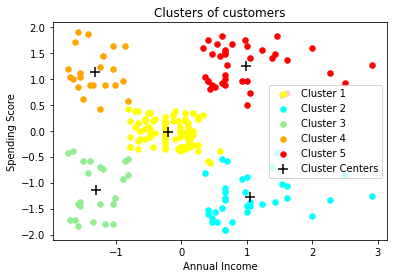

# Mall_Customer_Segmentation-Clustering-

A small project representing the clustering of the customers of a particular mall based on different criteria to analyse the mall customer segmentation. It is created using the simple k-means clustering algorithm.

## Usage
- Cloning the Repository: 

        git clone https://github.com/theAdarshSrivastava/Mall_Customer_Segmentation-Clustering-.git
        
- Entering the directory: 

        cd Mall_Customer_Segmentation-Clustering-
        
- Setting up the Python Environment with dependencies:

        pip install -r requirements.txt

- Running the file:

        python3 Mall Customer Segmentation.py
        
## Output

## Observations

a. High Income, High Spending Score (Cluster 5) - Target these customers by sending new product alerts which would lead to increase in the revenue collected by the mall as they are loyal customers.

b. High Income, Low Spending Score (Cluster 3) - Target these customers by asking the feedback and advertising the product in a better way to convert them into Cluster 5 customers.

c. Average Income, Average Spending Score (Cluster 2) - Can target these set of customers by providing them with Low cost EMI's etc.

d. Low Income, High Spending Score (Cluster 1) - May or may not target these group of customers based on the policy of the mall.

e. Low Income, Low Spending Score (Cluster 4) - Don't target these customers since they have less income and need to save money.
